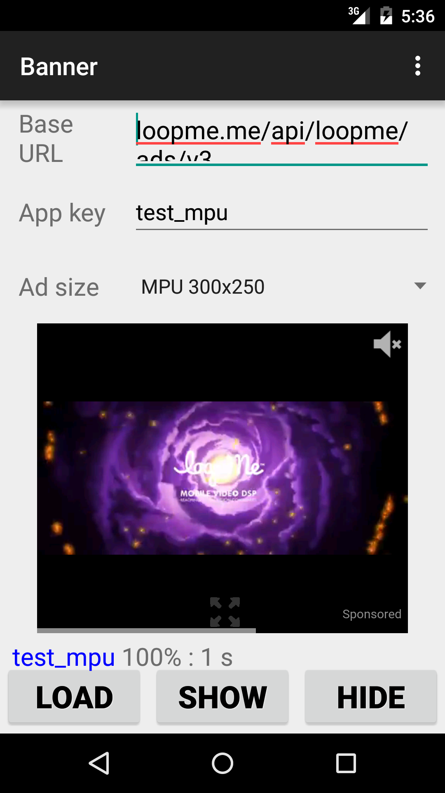
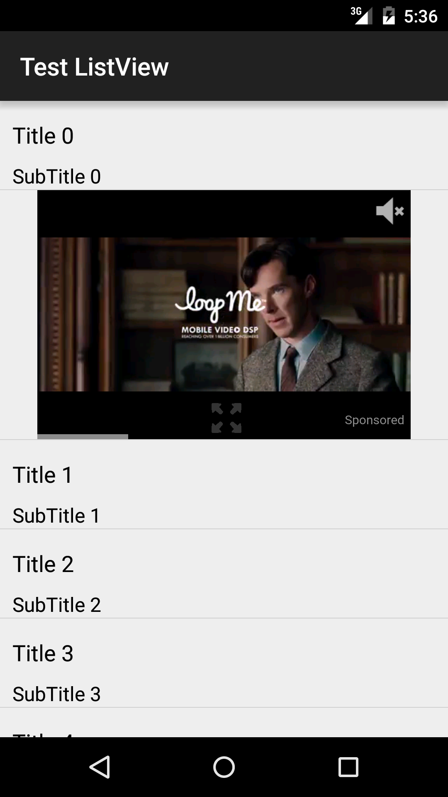
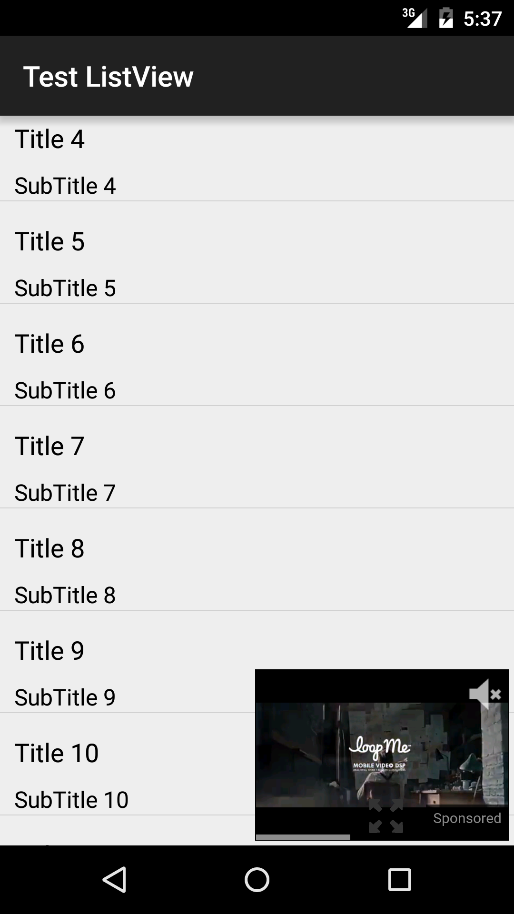

# LoopMe-Android-SDK #

[点击阅读SDK对接中文说明](README_CHINESE.md)

1. **[Overview](#overview)**
2. **[Features](#features)**
3. **[Requirements](#requirements)**
4. **[SDK Integration](#sdk-integration)**
  * **[Interstitial ads](#interstitial-ads)**
  * **[Banner ads](#banner-ads)**
  * **[Native video ads](#native-video-ads)**
  * **[Check integration](#check-integration)**
5. **[Sample projects](#sample-projects)**
6. **[Advanced Settings](#advanced-settings)**
7. **[FAQ](#faq)**
8. **[What's new](#whats-new)**

## Overview ##

LoopMe is the largest mobile video DSP and Ad Network, reaching over 1 billion consumers world-wide. LoopMe’s full-screen and banner ad formats deliver more engaging mobile advertising experiences to consumers on smartphones and tablets.

If you have questions please contact us at support@loopmemedia.com.

## Features ##

* Interstitial, banner, native video ad formats
* Image / Rich media / Video / 360 video
* Preloaded video ads
* Minimized video mode
* Expand to fullscreen mode
* In-app ad reward notifications, including video view completed

## Requirements ##

Requires `Android` 4.4 and up. If you have lower version please see the "Merging manifests" section.

## SDK Integration ##

<h3>Download</h3>
There are 2 ways:<br><br>
1. Download latest version of SDK (`loopme-sdk-[version].aar` file) and put it in folder `libs`. <br>
Add dependency to `loopme-sdk` in your project (`build.gradle` file):<br>
``` repositories { flatDir { dirs 'libs' } }```
<br>
``` dependencies { compile ( name: 'loopme-sdk-[version]', ext: 'aar' ) }```
<br><br>
2. LoopMe SDK is available as an AAR via jCenter.<br>
To use it, add the following to your `build.gradle` file:<br>
```repositories { jcenter () }```
<br>
```dependencies { compile 'com.loopme:loopme-sdk:5.1.11@aar' }
    compile 'com.google.android.gms:play-services-ads:9.6.1'```


<br>An appKey is required to use the `loopme-sdk`. The appKey uniquely identifies your app to the LoopMe ad network. (Example appKey: 7643ba4d53.) To get an appKey visit the **[LoopMe Dashboard](https://app.loopme.com/login/)**, and follow **[instruction](https://docs.google.com/document/d/1mXoWMVMvrfd5URvpWfCnFt89uL96PgT7usisCTa1K34/edit#)**. <br>

<b>Note</b>: For testing purposes better to use pre-installed app keys:<br>
For interstitial - `LoopMeInterstitial.TEST_PORT_INTERSTITIAL` and `LoopMeInterstitial.TEST_LAND_INTERSTITIAL`<br>
For banner and native video - `LoopMeBanner.TEST_MPU_BANNER`
<br><br>Then if everything is ok, you can change pre-installed app key to your real app key.
<br>Integration instructions for different ad types (Image / Rich media / Video / 360 video) are same.

## Interstitial ads ##


* Init and load
```java
public class YourActivity extends Activity implements LoopMeInterstitial.Listener {
  
  private LoopMeInterstitial mInterstitial;

  @Override
  protected void onCreate(Bundle savedInstanceState) {
	super.onCreate(savedInstanceState);

	mInterstitial = LoopMeInterstitial.getInstance(YOUR_APPKEY, this);
	mInterstitial.setListener(this);
	
	mInterstitial.load();
  }
}
```

* Show interstitial ads

Displaying the `LoopMeInterstitial` can be user-initiated (e.g press on button) or publisher-initiated (e.g. end of game level)<br>
<b>NOTE:</b> This method should be triggered after receive `onLoopMeInterstitialLoadSuccess()` notification.
```java
  mInterstitial.show();
```

* Destroy interstitial

Destroy when it is no longer needed to clean up resources.
```java
  mInterstitial.destroy();
```

* Interstitial notifications

Implement `LoopMeInterstitial.Listener` in order to receive notifications during the loading/displaying ad processes, that you can use to trigger subsequent in-app events:
 * `onLoopMeInterstitialLoadSuccess`: triggered when interstitial has been loaded the ad content
 * `onLoopMeInterstitialLoadFail`: triggered when interstitial failed to load the ad content
 * `onLoopMeInterstitialShow`: triggered when interstitial ad appeared on the screen
 * `onLoopMeInterstitialHide`: triggered when interstitial ad disappeared from the screen
 * `onLoopMeInterstitialVideoDidReachEnd`: triggered when interstitial video ad has been completely watched
 * `onLoopMeInterstitialClicked`: triggered when interstitial ad was clicked
 * `onLoopMeInterstitialExpired`: triggered when interstitial ad is expired, it is recommended to re-load


## Banner ads ##



`LoopMeBanner` class provides facilities to display a custom size ads during natural transition points in your application.

* Update `AndroidManifest.xml`
```xml
<activity android:name="ActivityWhereBannerLocated" android:hardwareAccelerated="true"/>
```
* Add `LoopMeBannerView` in layout xml
```xml
<RelativeLayout xmlns:android="http://schemas.android.com/apk/res/android"
        android:id="@+id/container"
        android:layout_width="match_parent"
        android:layout_height="wrap_content">
    <com.loopme.LoopMeBannerView
        android:id="@+id/video_ad_spot"
        android:layout_width="300dp"
        android:layout_height="250dp"
        android:layout_centerHorizontal="true" />
</RelativeLayout>
```

* Init `LoopMeBanner`
```java
public class SimpleBannerActivity extends AppCompatActivity implements LoopMeBanner.Listener {

    private LoopMeBanner mBanner;
    private LoopMeBannerView mAdSpace;

    @Override
    protected void onCreate(Bundle savedInstanceState) {
        super.onCreate(savedInstanceState);

        //some code

        mAdSpace = (LoopMeBannerView) findViewById(R.id.video_ad_spot);

        mBanner = LoopMeBanner.getInstance(YOUR_APPKEY, this);
        mBanner.setListener(this);
        mBanner.bindView(mAdSpace);
        mBanner.load();
    }

    @Override
    protected void onPause() {
        mBanner.pause();
        super.onPause();
    }

    @Override
    protected void onResume() {
        mBanner.resume();
        super.onResume();
    }

    @Override
    public void onBackPressed() {
        mBanner.destroy();
        super.onBackPressed();
    }
}
```
* Display banner
<br><b>NOTE:</b> This method should be triggered after receive `onLoopMeBannerLoadSuccess()` notification.
```java
mBanner.show();
```

* `LoopMeBanner` notifications

Implement `LoopMeBanner.Listener` in order to receive notifications during the loading/displaying ad processes, that you can use to trigger subsequent in-app events:
 * `onLoopMeBannerLoadSuccess`: triggered when banner has been loaded
 * `onLoopMeBannerLoadFail`: triggered when banner failed to load the ad content
 * `onLoopMeBannerShow`: triggered when banner appeared on the screen
 * `onLoopMeBannerHide`: triggered when banner disappeared from the screen
 * `onLoopMeBannerVideoDidReachEnd`: triggered when video in banner has been completely watched
 * `onLoopMeBannerClicked`: triggered when banner was clicked
 * `onLoopMeBannerExpired`: triggered when banner is expired, it is recommended to re-load
 * `onLoopMeBannerLeaveApp`: triggered if SDK initiated app switching. E.g after click on ad user is redirected to market (or any other native app)


## Native video ads ##



Native video ads used to show banner inside `ListView`/`RecyclerView`.

* Update `AndroidManifest.xml`
```xml
<activity android:name="ActivityWhereBannerLocated" android:hardwareAccelerated="true"/>
```
* Create xml layout for ad
```xml
list_ad_row.xml

<RelativeLayout xmlns:android="http://schemas.android.com/apk/res/android"
    android:id="@+id/container"
    android:layout_width="match_parent"
    android:layout_height="wrap_content">

    <com.loopme.LoopMeBannerView
        android:id="@+id/lm_banner_view"
        android:layout_width="300dp"
        android:layout_height="250dp"
        android:layout_centerHorizontal="true"/>
</RelativeLayout>
```

* Init `NativeVideoAdapter`
<br>In case of integration in `RecyclerView`, you need to use `NativeVideoRecyclerAdapter` class.

```java
public class YourActivity extends Activity implements LoopMeBanner.Listener {
  
  private ListView mListView;
  private NativeVideoAdapter mNativeVideoAdapter;
  private String mAppKey = YOUR_APPKEY;

  @Override
  protected void onCreate(Bundle savedInstanceState) {
	super.onCreate(savedInstanceState);
  
  	//...
  	
	YourCustomAdapter adapter = new YourCustomAdapter(this, mList);

        //Init LoopMe adapter
        mNativeVideoAdapter = new NativeVideoAdapter(adapter, this, mListView);
        mNativeVideoAdapter.putAdWithAppKeyToPosition(mAppKey, 1);
        mNativeVideoAdapter.setAdListener(this);
        NativeVideoBinder binder = new NativeVideoBinder.Builder(R.layout.list_ad_row)
                .setLoopMeBannerViewId(R.id.lm_banner_view)
                .build();
        mNativeVideoAdapter.setViewBinder(binder);

        mListView.setAdapter(mNativeVideoAdapter);
        mNativeVideoAdapter.loadAds();
  }
  
  @Override
    protected void onPause() {
        super.onPause();
        mNativeVideoAdapter.onPause();
    }

    @Override
    protected void onResume() {
        super.onResume();
        mNativeVideoAdapter.onResume();
    }

    @Override
    public void onBackPressed() {
        mNativeVideoAdapter.destroy();
        super.onBackPressed();
    }
}
```
Ad will be shown automaticly after load complete. 


## Check integration ##

If everything done correctly you will get loadSuccess() notification and see ads. 
<br>If something wrong check LogCat.
In case of "No ads found" error - contact to your LoopMe manager (it is about campaign configuration).

## Sample projects ##

Check out our project samples:
- `banner-sample` as an example of integration banner and native video ads
- `interstitial-sample` as an example of interstitial integration

## Advanced Settings ##

* <b>Custom request parameters</b><br>
You can add new parameter(s) in request by calling:
`addCustomParameter(String param, String paramValue)` method from `LoopMeInterstitial` or `LoopMeBanner` instance.

* <b>Clear cache</b><br>
For remove all videos ads from cache call `clearCache()` method from `LoopMeInterstitial` or `LoopMeBanner` instance.

* <b>Check current ad status</b><br>
There are few commands to check current ad status:
`isLoading()`, `isReady()`, `isShowing()`.

* <b>Change cache storage time</b><br>
By default, video files stays in cache during 32 hours. If you need to change it call 
`setVideoCacheTimeInterval(long milliseconds)` value.

* <b>Targeting params</b><br>
Targeting settings include gender, year of birth and keywords. Define it with `setGender(String gender)`, `setYob(int yob)` and `setKeywords(String keywords)` methods from `LoopMeInterstitial` or `LoopMeBanner` instance.
They will be added in ad request.

* <b>Config minimized mode</b><br>
Minimized mode can be configured only for native video ads.
```java
// root_view - the root view in layout
RelativeLayout root = (RelativeLayout) findViewById(R.id.root_view);
MinimizedMode mode = new MinimizedMode(root);
mNativeVideoAdapter.setMinimizedMode(mode);
```



* <b>Config preloading settings</b><br>
By default video ad can be loaded only on wi-fi connection. To turn on it also for mobile network you need to call `useMobileNetworkForCaching(true)`

* <b>Merging manifests</b><br>
In case your application supports API version < 19 you should add<br>
`<uses-sdk tools:overrideLibrary="com.loopme"/>`

* <b>ProGuard tool known issue</b><br>
Using ProGuard tool can break LoopMe SDK work. It may look like all works fine in debug mode and stops working in production mode. To avoid of such cases please add these lines in the ProGuard configuration file. Also, in case you integrate LoopMe SDK via mediations make sure they are listed here too. The default recomendation is:
```java
-dontwarn com.loopme.**
-keep class com.loopme.** {
*;
}
```

## FAQ ##
1. <b>Which API supports 'In-app ad reward notifications, including video view completed'?</b>
<br>For interstitial use `onLoopMeInterstitialVideoDidReachEnd()` notification (triggered when interstitial video ad has been completely watched).<br>
For banner nad native video - `onLoopMeBannerVideoDidReachEnd()` notification.<br><br>
2. <b>When the user is watching a pre-load video, will LoopMe SDK start to request to 2nd ads?<br>
Can ads play when loading (1 ad)?<br>
Can an application request a new ad when the user is at 50% of the previous ad? Or it have to wait for the user to finish the previous ad?<br>
How can a publisher to pre-cache 3-4 ads under Wifi environment?<br>
Is it possible to precache a few videos at 1 time (and 1 app key)?<br>
Can a pub set it loading and playing same time?</b><br>
You can have only one ad per appkey preloaded or running.<br>
So reloading a new ad will cancel the current. However you can have several appkeys for one ad spot thus having several ads preloaded. Or playing one ad while preloading another using a different appkey. Please note that some ads can have own download processes while executed. So downloading other ads can affect on both running and preloading.<br><br>
3. <b>Can LoopMe SDK support pre-cache in wifi environment and play without wifi environment?<br>
If a user watches the video when offline, how can we know if the user has watched it or not?<br> Will all the activities of users be saved and post back to the SDK even if it's offline?</b><br>
To report display, video or other types of events SDK requires internet connection. SDK does not display the ad if there is no internet connection found.<br><br>
4. <b>We can preload video under WIFI. What is the WIFI definition? Only pure wifi or might preload if the user is connecting other people’s hotspot.</b><br>
We have the only restriction here for mobile carrier internet. Others sources can be used for downloading ads.<br><br>
5. <b>What timeouts for ads the SDK has?</b><br>
Up to 20 sec to get response from the ad Server.<br>
Up to 3 minutes your application waits for the video to be uploaded from the server.<br>
Up to 1 hr for the loaded ad to be displayed or else it expires and can not be displayed with Show() method.<br>
Up to 32 hours a video file is stored in a handset cache and can be reloaded from there.<br><br>
6. <b>if a user completes a video, but stays at the same page, is there a replay button? Or will another video start to play right after the first one?</b><br>
For interstitial video a reply button appears in the end. No other video is displayed unless a pub prepared another ad to show at this moment.<br><br>
7. <b>How does the publisher set rewarded full-screen video? Only in their dashboard or they need to do some technical things in their end?<br>
If they want to switch to rewarded full-screen video, do they need to update the version? Or just change in dashboard?</b><br>
A publisher can set this parameter in LoopMe dashboard in hiss account. There are no extra technical efforts required.<br><br>
8. <b>Is there any time requirement between the two ads? If one ad has been watched, how long can the ads slots show the second ads?</b><br>
There are no delays between ads, but you should remember that you need to download next ad first and it takes some time.<br><br>
9. <b>If the user’s system is below Android 4.4(API level 19), can they see video ads?</b><br>
No. If the minimal requirements provided on github are not met, the integrations is not recommended. But you can see the "Merging manifests" section.<br>
In this case, you as a developer should specify there all list of libraries on which will be errors from compiler. It should be a list of libraries which require a version bigger than in your app but less than 4.4.<br><br>
10. <b>Can I ignore the permission WRITE_EXTERNAL_STORAGE?</b><br>
No. As it uses for video ads preloading.<br><br>
11. <b>What is average size of a video file?</b><br>
Usually it has 5-7Mb.<br><br>
12. <b>Do you have Mopub or anyone else adapter?</b><br>
Yes. **[Here](https://loopme.biz/wiki/index.php?title=Supported_In-App_SDK_mediation_networks)** you can find the direct links to all bridges we support.<br><br>
13. <b>What permissions does your SDK ask?</b><br>
Internet connection<br>
Network state<br>
WiFi state<br>
Coarse location<br>
Fine location<br>
Vibrate option<br>
Accounts<br>
Phone state<br>
External storage<br>
However if your SDK does not require some of them you can switch them off in your manifest file. The SDK still be able to show ads but some advanced targeting features would be unavailable.<br><br>
14. <b>How to remove extra permissions that are not required by my application?</b><br>
You can remove permissions that are stand out from your application permissions. To exclude them please add these kind of lines into your manifest file:<br>
```xml <uses-permission android:name="android.permission.READ_PHONE_STATE" tools:node="remove"/>```<br>
```xml <uses-permission android:name="android.permission.GET_ACCOUNTS" tools:node="remove"/>```<br><br>
15. <b>What is the size of your Android SDK?</b><br>
250Kb.<br><br>
16. <b>What type of data collected by your SDK?</b><br>
The information that allows to identify a device to serve appropriate ads or stop serving ads in case of capping. Device Id, country, language, user agent, COPPA flag, IP address, DNT flag etc. As LoopMe SDK has an open source code -- see the 'loopme-sdk' file.<br><br>
17. <b>Does your ad request access to device’s connectivity capabilities and geolocation?</b><br>
Yes. As users should get relevant ads based on the country when they can get the advertised product. This helps avoid confusing ads with a game that is not available on the local Appstore or GooglePlay markets or offline trade networks a user can not find in their country. Also if a user has no internet connection they can not get to the advertised product page or as well as download the ad itself.<br><br>
18. <b>Does LoopMe SDK supports native ads?</b><br>
LoopMe SDK has a small video format Video MPU banner which allows to show video in content. However, it does not support traditional Native ad format with icon, title, description text etc.<br>


## What's new ##
**Version 5.1.12**
- Added MOAT SDK viewability measurement support for Native and Rich Media ads

**Version 5.1.11**
- Ads targeting improvements

**Version 5.1.10**
- Bug fixes. Added AMR support

**Version 5.1.9**
- Bug fixes. Added AMR support

**Version 5.1.8**
- Bug fixes. Added AMR support

**Version 5.1.8**
- Performance improvements. Bug fixes.
- MRAID compliancy improvements

**Version 5.1.7**
- Ads targeting improvements: better fit to device type and screens

**Version 5.1.6**
- Bug fixing

**Version 5.1.5**
- Bug fixing
- Ads delivery performance improvements

**Version 5.1.4**
- Added Corona plugin support

**Version 5.1.3**
- Bug fixes

**Version 5.1.2**
- Ads delivery performance improvements

**Version 5.1.1**
- Bug fixes

**Version 5.1.0**
- Updated error log
- Bug fixes

See [Changelog](CHANGELOG.md)


## License ##

See [License](LICENSE.md)
