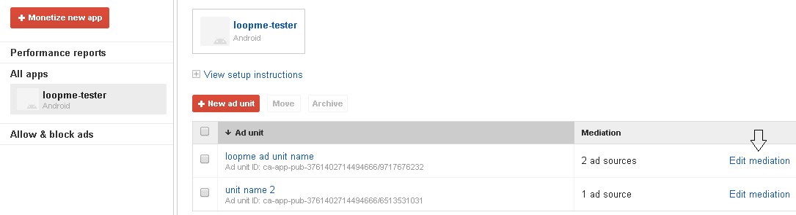
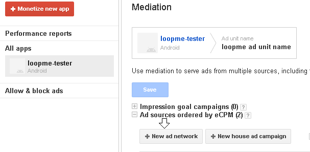
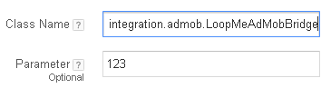

# Android AdMob Bridge #

1. **[Overview](#overview)**
2. **[Register on LoopMe network](#register-on-loopme-network)**
3. **[Adding LoopMe Android SDK](#adding-loopme-android-sdk)**
4. **[Adding LoopMe's AdMob Bridge](#adding-loopmes-admob-bridge)**
5. **[Mediate from AdMob Interstitial to LoopMe Interstitial Ad](#mediate-from-admob-interstitial-to-loopme-interstitial-ad)**
8. **[Sample project](#sample-project)**

## Overview ##

LoopMe is the largest mobile video DSP and Ad Network, reaching over 1 billion consumers world-wide. LoopMe’s full-screen video and rich media ad formats deliver more engaging mobile advertising experiences to consumers on smartphones and tablets.
LoopMe supports SDK bridges to ad mediation platforms. The LoopMe SDK bridge allows you to control the use of the LoopMe SDK via your existing mediation platform.

`LoopMe Android bridge` allows publishers monitize applications using `AdMob mediation ad platform`.

<b>NOTE:</b> This page assumes you already have account on `AdMob` platform and integrated with the `AdMob` Android SDK

If you have questions please contact us at support@loopme.com.

## Register on LoopMe network ##

To use and setup the SDK bridge, register your app on the LoopMe network via the LoopMe Dashboard to retrieve a unique LoopMe app key for your app. The app key uniquely identifies your app in the LoopMe ad network (Example app key: 51bb33e7cb). 
You will need the app key during next steps of integration.

## Adding LoopMe Android SDK ##

* Add the following to your `build.gradle`:
```java
repositories {
    jcenter()
}

dependencies {
    compile 'com.loopme:loopme-sdk:5.1.7@aar'
}
```

## Adding LoopMe's AdMob Bridge ##

Download `LoopMeAdMobBridge` class and move it to `com.integration.admob` package in your project.
NOTE: `LoopMeAdMobSampleActivity` is just a sample how to use `LoopMeAdMobBridge`. 

## Mediate from AdMob Interstitial to LoopMe Interstitial Ad ##

<br><b>Configure Ad Network Mediation on AdMob</b>
<br><b>NOTE:</b> This page assumes you already have account on AdMob and Ad unit(s)
* Click Edit Mediation for an Ad unit
<p></a>

* Click "New Ad Network"
<p></a>

* On next screen select “+ custom event”. You will get:
<p></a>

<br>Class Name should be: `com.integration.admob.LoopMeAdMobBridge`.
<br>Parameter: enter the app key value you received after registering your app on the LoopMe dashboard. E.g. 298f62c196

* Init
```java
mInterstitialAd = new InterstitialAd(this);
mInterstitialAd.setAdUnitId(YOUR_AD_UNIT_ID);
```

* Load 
```java
AdRequest.Builder builder = new AdRequest.Builder();
//your configs
mInterstitialAd.loadAd(builder.build());
```

* Show
```java
mInterstitialAd.show();
```

## Sample project ##

Check out our `LoopMeAdMobSampleActivity` as an integration example.

